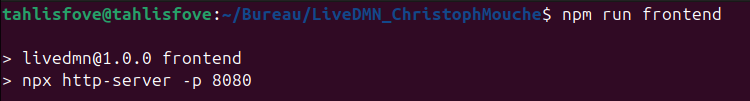
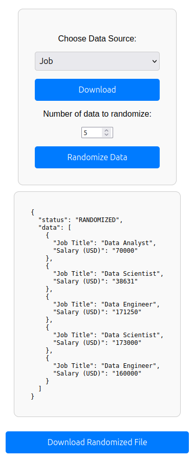

# LiveDMN

LiveDMN est un projet backend permettant de gérer des données provenant de fichiers CSV compressés (ZIP ou GZ). L'objectif est de permettre à un utilisateur de télécharger des fichiers à partir de différentes sources, de les extraire, de randomiser les lignes, et de sauvegarder les résultats. Les logs des requêtes sont également enregistrés dans une base de données PostgreSQL pour un suivi complet.

 

## Fonctionnalités

### Fonctionnalités principales
- **Téléchargement de fichiers CSV compressés** : Supporte les formats `.zip` et `.gz`.
- **Extraction des fichiers CSV** : Extraction des fichiers compressés pour obtenir un fichier CSV.
- **Randomisation des données** : Sélection aléatoire d'un nombre donné de lignes dans un fichier CSV.
- **Sauvegarde des logs** : Enregistrement des requêtes dans une base de données PostgreSQL.

 

## Technologies utilisées

- **Node.js** : Environnement d'exécution pour le backend.
- **Express.js** : Framework utilisé pour créer l'API.
- **TypeScript** : Langage pour une meilleure gestion des types et de la robustesse du code.
- **Axios** : Pour le téléchargement de fichiers depuis des URLs externes.
- **PapaParse** : Bibliothèque pour l'analyse et le parsing des fichiers CSV.
- **Yauzl** : Utilisé pour extraire les fichiers CSV des archives ZIP.
- **zlib** : Permet de décompresser les fichiers GZ`.
- **TypeORM** et **PostgreSQL** : Gestion des bases de données et des logs.

 

## 0. Prérequis

Avant de commencer, vous aurez besoin de :

1. **Node.js** (version >= 16)
2. **npm** (gestionnaire de paquets)
3. **PostgreSQL** (installé et configuré)
4. **Espace disque suffisant** : (25 Go pour les fichiers)

 

## Installation et démarrage

### 1. Cloner le projet

    git clone https://github.com/tahlisfove/LiveDMN
    cd ~/LiveDMN

### 2. Installer les dépendances

    npm install typescript

### 3. Installer le service de la base de données (si ce n'est pas déjà fait)

    sudo apt install postgresql postgresql-contrib -y

### 4. Créer la base de données et autoriser l'accès

    sudo -u postgres psql

    postgres=# ALTER USER postgres PASSWORD 'password';
    postgres=# CREATE DATABASE request;
    postgres=# GRANT ALL PRIVILEGES ON DATABASE request TO postgres;
    postgres=# \q

### 5. Compiler le projet TypeScript

    npx tsc

### 6. Démarrer le backend (dans un premier terminal)

    npm run backend

### 7. Démarrer le frontend (dans un second terminal)

    npm run frontend

### 8. Accédez à l'application

    http://localhost:8080/LiveDMN.html

  

## 1. Arborescence du projet

├── css/ 
│   └── style.css 
│ 
├── img/ 
│   ├── favicon.png 
│   └── ... 
│ 
├── ts/ 
│   ├── backend/ 
│   │   ├── entities/ 
│   │   │   └── RequestLog.ts 
│   │   ├── data-source.ts 
│   │   ├── gzFileHandler.ts 
│   │   ├── randomiser.ts 
│   │   ├── server.ts 
│   │   ├── utils.ts 
│   │   └── zipFileHandler.ts 
│   └── frontend/ 
│       └── main.ts 
│ 
├── LiveDMN.html 
├── package.json 
├── package-lock.json 
├── tsconfig.json 
└── README.md 

  

## 2. Endpoints disponibles

### 1. Télécharger et extraire des fichiers

- **Route** : `GET /download-extract?source=<source>`

#### Paramètres :
| Nom      | Type   | Description                                  |
|----------|--------|----------------------------------------------|
| `source` | String | La source des données à télécharger. 

#### Réponse :  
Un lien de téléchargement pour le fichier CSV extrait.

 

### 2. Vérifier la disponibilité d'un fichier

- **Route** : `GET /check-file?source=<source>`

#### Paramètres :
| Nom      | Type   | Description                                  |
|----------|--------|----------------------------------------------|
| `source` | String | La source des données à vérifier.            |

#### Réponse :  
Un objet JSON indiquant si le fichier est disponible dans le dossier `dist`.  

 

### 3. Randomiser les données

- **Route** : `POST /randomize-data`

#### Paramètres :
| Nom         | Type   | Description                                                       |
|-------------|--------|-------------------------------------------------------------------|
| `source`    | String | La source du fichier à randomiser (`openfoodfacts`, `job`, ...).  |
| `numValues` | Number | Le nombre de lignes à sélectionner aléatoirement.                 |

#### Exemple de requête :

    {
      "source": "openfoodfacts",
      "numValues": 100
    }

#### Réponse :

    {
      "status": "RANDOMIZED",
      "data": [
        { "Barcode (EAN 13)": "1234567890123", "Country": "France" },
        { "Barcode (EAN 13)": "9876543210987", "Country": "Germany" }
      ]
    }

  

## 3. Sauvegarde des logs

Les logs des requêtes sont automatiquement enregistrés dans une base de données PostgreSQL. Chaque log inclut les informations suivantes :

- **`source`** : La source du fichier CSV (`openfoodfacts`, `job`, ou `nudger`).
- **`numValues`** : Le nombre de lignes randomisées.
- **`extractedData`** : Les données randomisées au format JSON.
- **`requestTime`** : Date et heure de la requête.

#### Exemple d'enregistrement dans la base de données :

    {
      "source": "openfoodfacts",
      "numValues": 100,
      "extractedData": [
        { "Barcode (EAN 13)": "1234567890123", "Country": "France" },
        { "Barcode (EAN 13)": "9876543210987", "Country": "Germany" }
        ...
      ],
      "requestTime": "2024-12-21T08:00:00Z"
    }

  

## 4. Accès à la base de données

Vous pouvez accéder à la base de données PostgreSQL utilisée pour enregistrer les logs des requêtes. Voici les étapes pour vous connecter et interroger la base de données :

### Étapes pour accéder à la base de données

1. Ouvrez un terminal.
2. Exécutez la commande suivante pour vous connecter à la base de données

        psql -h localhost -U postgres -d request

3. Lors de la connexion, il vous sera demandé de saisir le mot de passe.
   
        password
   
5. Une fois connecté, vous pouvez exécuter des requêtes SQL. Par exemple :

        SELECT * FROM request_log;

#### Exemple de requête :
| id  | source        | numValues | extractedData                        | requestTime            |
| --- | ------------- | --------- | ------------------------------------ | ---------------------- |
| 1   | openfoodfacts | 100       | `[{"key":"value"}...]`               | 2024-12-21 10:00:00+00 |
| 2   | job           | 50        | `[{"key":"value"}...]`               | 2024-12-21 10:23:00+00 |

  

## 5. Test du système

### 1. Installer les dépendances et démarrer le backend

    npm install typescript
    npx tsc
    npm run backend
    

 

### 2. Connexion au Backend

Une fois connecté au backend, le système vous proposera de vider la table \`request\`. Vous devrez faire un choix via le terminal, "y" ou "n".

 

### 3. Démarrer le frontend

    npm run frontend
    

 

### 4. Accéder à l'application Frontend

Ouvrez votre navigateur et accédez à l'adresse suivante :

    http://localhost:8080/LiveDMN.html

La page utilisateur s'ouvrira.

 

### 5. Sélectionner un Dataset

Dans l'interface frontend, vous pouvez choisir un jeu de données à traiter depuis un menu déroulant (\`select\`). Vous pouvez également télécharger ce jeu de données. Une fois téléchargé, un message de succès apparaît et un message est affiché dans le terminal.

 

 

### 6. Bouton "Randomize"

Le bouton "Randomize" devient cliquable après avoir téléchargé un fichier. Cependant, si vous changez de dataset sans avoir téléchargé un fichier, ce bouton ne sera pas disponible.

 

 

### 7. Randomiser les Données

Choisissez un fichier à traiter ainsi que le nombre de données à randomiser. Une fois le processus terminé, un message de succès s'affiche, ainsi qu'un message dans le terminal.

 

 

### 8. Affichage des Valeurs

Une fois la randomisation terminée, les valeurs d'entrée sont affichées dans le terminal. (Cette option a été désactivée par défaut car elle peut être illisible pour de grandes valeurs, mais vous pouvez l'activer en définissant \`"logging": true\` dans le fichier \`data-source.ts\`.)

 

 

### 9. Télécharger le Fichier Randomisé

Un bouton vous permet de télécharger le dernier fichier généré après la randomisation.

 

### 10. Vérification des Données dans la Base

Vous pouvez également vérifier les valeurs enregistrées dans la base de données pour vous assurer que la randomisation a bien été effectuée.

- Base de données vide :

- Base de données remplie :

 

### 11. Fichiers Générés

Tous les fichiers générés (JavaScript, CSV et JSON) sont disponibles dans le dossier \`dist/\`, généré à la racine du projet lors de la compilation. Si vous souhaitez libérer de l'espace ou retrouver ces fichiers, vous pouvez supprimer ce dossier.

  

## 6. Limitations et Améliorations

### Limitations

- **Structure fixe des fichiers CSV** :  
  L'approche actuelle repose sur une structure prédéfinie pour chaque fichier CSV. Si cette structure change, le code devra être modifié manuellement pour s'adapter. Cela limite la flexibilité et l'évolutivité du projet.

### Améliorations

- **Flexibilité des fichiers CSV** :  
  Une amélioration majeure serait d'automatiser la détection des colonnes à randomiser. Cela permettrait de supporter une plus grande variété de formats de fichiers CSV sans nécessiter d'intervention manuelle.

  

## 7. Auteur

Projet développé par Christoph Samuel.

- **Email** : gdtsamuelchrist@gmail.com 
- **GitHub** : https://github.com/tahlisfove
